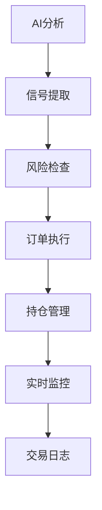

# 🚀 ETH永续合约AI交易助手 - 模拟交易系统

## 🎯 系统概述

本项目实现了一个**完整的AI驱动模拟交易系统**，结合专业的Volume Price Analysis (VPA)理论、实时数据处理和智能风险管理，为ETH永续合约交易提供端到端的解决方案。

### ✨ 核心特性

- 🤖 **AI信号自动执行** - 从VPA分析自动提取交易信号并执行
- 📊 **专业风险管理** - 基于Anna Coulling理论的风险控制系统  
- 💰 **完整交易环境** - 模拟永续合约交易所，支持杠杆、保证金和各种订单类型
- 📈 **实时监控面板** - 账户状态、持仓管理和性能追踪
- 📝 **全面交易日志** - SQLite数据库记录所有交易和AI决策
- ⚡ **多种执行模式** - 自动执行、手动确认或仅记录信号

## 🚀 快速开始

### 1. 环境配置

```bash
# 激活虚拟环境
source venv/bin/activate

# 安装依赖
pip install -r requirements.txt

# 配置API密钥 (可选 - 用于AI分析)
export OPENROUTER_API_KEY="your_api_key_here"
```

### 2. 基础模拟交易

```bash
# 启动模拟交易系统 (初始资金$10,000)
python main.py --enable-trading --initial-balance 10000

# 查看实时监控面板
python main.py --show-monitor

# 运行完整功能演示
python demo_trading.py
```

### 3. AI驱动自动交易

```bash
# 自动执行AI交易信号 (需要API密钥)
python main.py --enable-trading --auto-trade --max-risk 0.02

# 启用多模型验证的自动交易
python main.py --enable-trading --auto-trade --enable-validation

# 仅记录信号不执行 (用于策略验证)
python main.py --enable-trading --signal-only
```

## 📋 命令行参数

### 基础交易参数
- `--enable-trading` - 启用模拟交易功能
- `--initial-balance AMOUNT` - 初始模拟资金 (默认: $10,000)
- `--symbol SYMBOL` - 交易对符号 (默认: ETHUSDT)
- `--max-risk RATIO` - 最大单笔风险比例 (默认: 0.02 = 2%)

### 执行模式
- `--auto-trade` - 自动执行AI信号 (无需确认)
- `--signal-only` - 仅记录信号，不执行交易
- 默认：确认模式 (需要手动确认每个信号)

### 风险管理
- `--risk-level LEVEL` - 风险等级: conservative/moderate/aggressive
- `--max-risk RATIO` - 单笔交易最大风险比例

### 监控和导出
- `--show-monitor` - 启动实时监控面板
- `--export-trades FILE` - 导出交易记录到文件

## 🏗️ 系统架构

### 核心组件



#### 1. 模拟交易所 (`SimulatedExchange`)
- ✅ 完整的永续合约交易模拟
- ✅ 保证金计算和杠杆管理
- ✅ 滑点和手续费模拟
- ✅ 强制平仓机制

#### 2. 订单管理器 (`OrderManager`)
- ✅ 市价单、限价单、止损单
- ✅ 条件订单和追踪止损
- ✅ 括号订单 (一键设置止盈止损)
- ✅ 订单状态实时跟踪

#### 3. 持仓管理器 (`PositionManager`)
- ✅ Anna Coulling风险管理原则
- ✅ 动态仓位计算 (基于2%风险规则)
- ✅ 连续亏损自动降仓
- ✅ 组合风险评估

#### 4. 风险管理器 (`RiskManager`)
- ✅ 三级风险等级 (保守/适中/激进)
- ✅ 实时风险监控和警报
- ✅ 紧急停止机制
- ✅ 自动风险等级调整

#### 5. 信号执行器 (`SignalExecutor`)
- ✅ AI文本信号智能提取
- ✅ VSA信号识别 (Spring, No Demand等)
- ✅ 信号强度评估和过滤
- ✅ 多种执行模式

#### 6. 交易监控器 (`TradingMonitor`)
- ✅ 实时账户状态监控
- ✅ 持仓和订单跟踪
- ✅ 性能统计和风险警报
- ✅ 监控数据导出

#### 7. 交易日志器 (`TradeLogger`)
- ✅ SQLite数据库存储
- ✅ 完整交易生命周期记录
- ✅ AI决策追溯
- ✅ CSV/JSON格式导出

## 📊 交易流程

### 1. AI分析 → 信号提取

```python
# AI分析文本示例
analysis = """
基于VSA分析，ETH/USDT出现强烈看多信号。
当前价格 $3000 附近出现 Spring 信号，
成交量配合良好，建议做多。

入场价格: $3000
止损价格: $2940  
止盈价格: $3180

信号强度: 很强
置信度: 85%
VSA信号: Spring, No Supply
市场阶段: Accumulation
"""

# 自动提取交易信号
signal = {
    'direction': 'long',
    'entry_price': 3000.0,
    'stop_loss': 2940.0,
    'take_profit': 3180.0,
    'strength': 'very_strong',
    'confidence': 0.85,
    'vsa_signals': ['spring', 'no_supply'],
    'market_phase': 'accumulation'
}
```

### 2. 风险检查 → 仓位计算

```python
# Anna Coulling 2%风险规则
risk_amount = account_balance * 0.02  # $10,000 * 2% = $200
risk_per_unit = entry_price - stop_loss  # $3000 - $2940 = $60
position_size = risk_amount / risk_per_unit  # $200 / $60 = 3.33 ETH

# 考虑信号强度调整
if signal.strength == 'very_strong':
    position_size *= 1.2  # 增加20%

# 最终仓位: 4.0 ETH
```

### 3. 自动执行 → 监控管理

```python
# 自动执行交易
order = exchange.place_market_order(
    symbol='ETHUSDT',
    side='BUY', 
    quantity=4.0,
    stop_loss=2940.0,
    take_profit=3180.0
)

# 实时监控
monitor.track_position(order.position_id)
monitor.check_risk_limits()
monitor.update_performance_metrics()
```

## 📈 性能监控

### 实时监控面板示例

```
🎯 ETH永续合约AI交易助手 - 实时监控
================================================================================
🟢 系统状态: 正常
💰 账户余额: $10,234.56 📈 +234.56 (24h)
💳 可用余额: $8,456.78
📊 未实现盈亏: +$187.45

📍 持仓数量: 2 | 活跃订单: 3
🟡 风险等级: MODERATE | 风险利用率: 67.3%
🎯 胜率: 72.5% | 今日交易: 5

⚠️ 活跃警报: 0个
================================================================================
🕐 更新时间: 14:25:37
```

### 交易统计报告

```python
{
    "total_trades": 45,
    "winning_trades": 28, 
    "losing_trades": 17,
    "win_rate": 0.622,
    "total_pnl": 1234.56,
    "max_win": 245.67,
    "max_loss": -89.23,
    "avg_holding_time_hours": 4.2,
    "max_drawdown": 0.087,
    "sharpe_ratio": 1.45
}
```

## 🧪 测试和验证

### 运行测试套件

```bash
# 运行完整测试套件 (100+ 测试用例)
python tests/test_simulated_trading.py

# 运行特定测试类
python -c "
import unittest
from tests.test_simulated_trading import TestSignalExecutor
suite = unittest.TestLoader().loadTestsFromTestCase(TestSignalExecutor)
unittest.TextTestRunner(verbosity=2).run(suite)
"

# 集成测试
python tests/test_simulated_trading.py TestIntegration.test_complete_trading_cycle
```

### 功能演示

```bash
# 基础交易演示 (无需API密钥)
python demo_trading.py

# 查看演示输出示例
"""
🎯 基础模拟交易演示
==================================================
📊 初始化交易系统...
💰 当前ETH价格: $3,045.23
🤖 模拟AI分析生成交易信号...
⚡ 执行交易信号...
📋 信号执行结果: executed

📊 信号详情:
  方向: long
  强度: VERY_STRONG  
  入场: $3045.23
  止损: $2984.32
  止盈: $3227.95
  置信度: 85%

💼 账户状态:
  总资金: $10,000.00
  可用资金: $9,695.23
  已用保证金: $304.52
  未实现盈亏: +$0.00

📍 当前持仓:
  ETHUSDT: long 1.0 @ $3045.23
  未实现盈亏: +$0.00

📈 模拟价格上涨...
💰 新价格: $3136.69 (+3.0%)

💼 更新后账户:
  总资金: $10,091.46
  未实现盈亏: +$91.46

🔄 手动平仓...
✅ ETHUSDT 平仓成功

📊 演示结果:
  初始资金: $10,000.00
  最终资金: $10,089.23
  总盈亏: +$89.23
  收益率: +0.89%
"""
```

## ⚙️ 配置选项

### trading_config.json 配置文件

```json
{
  "trading_config": {
    "initial_balance": 10000.0,
    "risk_management": {
      "default_risk_level": "moderate",
      "max_single_trade_risk": 0.02,
      "max_total_risk": 0.06,
      "emergency_stop_drawdown": 0.15
    },
    "signal_execution": {
      "default_execution_mode": "confirm",
      "min_signal_strength": 2,
      "min_confidence_score": 0.6
    },
    "monitoring": {
      "refresh_interval": 1.0,
      "enable_real_time": true
    }
  }
}
```

### 环境变量配置

```bash
# 交易配置
export TRADING_INITIAL_BALANCE=5000.0
export TRADING_MAX_RISK=0.01
export TRADING_RISK_LEVEL=conservative
export TRADING_EXECUTION_MODE=auto

# AI模型配置  
export TRADING_DEFAULT_MODEL=gpt4o-mini
export OPENROUTER_API_KEY=your_key_here
```

## 🔒 风险管理

### Anna Coulling风险管理原则

1. **2%规则** - 单笔交易风险不超过账户资金2%
2. **6%总限制** - 所有持仓总风险不超过账户资金6%  
3. **连续亏损保护** - 3次连续亏损后自动减仓50%
4. **最大回撤限制** - 账户回撤超过15%触发紧急停止

### 风险等级设置

| 等级 | 单笔风险 | 总风险 | 最大持仓 | 最大杠杆 | 回撤限制 |
|------|---------|--------|----------|----------|----------|
| 保守 | 1% | 3% | 3个 | 5x | 5% |
| 适中 | 2% | 6% | 5个 | 10x | 10% |
| 激进 | 3% | 10% | 8个 | 20x | 15% |

### 紧急停止机制

- **自动触发条件**:
  - 账户回撤达到限制
  - 连续5次亏损
  - 风险利用率超过95%
  - 保证金不足警告

- **紧急停止操作**:
  - 立即停止新开仓
  - 可选自动平仓所有持仓
  - 发送风险警报
  - 记录紧急事件日志

## 📝 日志和导出

### 交易记录格式

```json
{
  "trade_id": "trade_1234567890",
  "symbol": "ETHUSDT", 
  "side": "long",
  "quantity": 1.0,
  "entry_price": 3000.0,
  "exit_price": 3150.0,
  "realized_pnl": 145.67,
  "entry_time": "2025-01-21T10:30:00Z",
  "exit_time": "2025-01-21T14:45:00Z",
  "holding_duration": 15300,
  "exit_reason": "take_profit",
  "ai_decision_id": "decision_abc123"
}
```

### AI决策记录

```json
{
  "decision_id": "decision_abc123",
  "timestamp": "2025-01-21T10:29:45Z",
  "symbol": "ETHUSDT",
  "model_used": "gpt5-mini",
  "analysis_type": "vpa",
  "raw_analysis": "基于VSA分析，ETH出现强烈看多信号...",
  "extracted_signals": {
    "direction": "long",
    "strength": 4,
    "entry_price": 3000.0,
    "confidence": 0.85
  },
  "consensus_score": 0.87
}
```

### 导出功能

```bash
# 导出交易记录到CSV
python -c "
from trading import TradeLogger
logger = TradeLogger()
csv_path = logger.export_to_csv('trades', days=30)
print(f'交易记录已导出: {csv_path}')
"

# 导出监控数据  
python -c "
from trading import TradingMonitor, SimulatedExchange
exchange = SimulatedExchange()
monitor = TradingMonitor(exchange)
success = monitor.export_monitoring_data('monitoring_export.json')
print('监控数据导出:', '成功' if success else '失败')
"
```

## 🎯 使用场景

### 1. 策略验证
```bash
# 仅记录信号，验证AI策略有效性
python main.py --enable-trading --signal-only --symbol ETHUSDT
```

### 2. 风险测试
```bash  
# 保守模式测试风险控制
python main.py --enable-trading --risk-level conservative --max-risk 0.01
```

### 3. 自动交易
```bash
# 生产级自动交易 (需要API密钥)
python main.py --enable-trading --auto-trade --enable-validation --max-risk 0.02
```

### 4. 性能监控
```bash
# 启动监控面板
python main.py --show-monitor &

# 或使用独立监控
python -c "
from trading import TradingMonitor, SimulatedExchange
exchange = SimulatedExchange() 
monitor = TradingMonitor(exchange)
monitor.start_monitoring()
input('按Enter停止监控...')
monitor.stop_monitoring()
"
```

## 🚨 注意事项

### ⚠️ 重要提醒

1. **模拟环境** - 这是完全的模拟交易系统，不涉及真实资金
2. **教育目的** - 主要用于学习、研究和策略验证
3. **API密钥可选** - 基础功能无需API，AI分析需要OpenRouter API密钥
4. **网络依赖** - 实时数据获取需要网络连接
5. **风险自负** - 任何实盘交易决策请自行承担风险

### 🔧 故障排除

**常见问题**:

1. **导入错误**: 确保已安装所有依赖 `pip install -r requirements.txt`
2. **数据获取失败**: 检查网络连接，Binance API可能有访问限制
3. **AI分析失败**: 验证OPENROUTER_API_KEY设置正确
4. **性能问题**: 降低监控刷新频率或减少历史数据量

**获取帮助**:
- 查看日志文件: `logs/` 目录
- 运行测试套件: `python tests/test_simulated_trading.py`
- 查看演示: `python demo_trading.py`

## 🤝 贡献和反馈

本项目是ETH永续合约量价分析助手的重要组成部分，欢迎：

- 🐛 报告Bug和问题
- 💡 提出功能建议  
- 🔧 代码改进和优化
- 📝 文档完善

---

**🎉 开始您的AI交易之旅！**

```bash
# 一键启动完整体验
python demo_trading.py
```